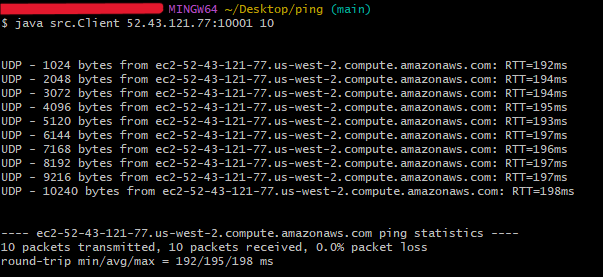

# Ping

This version of ping uses UDP instead of the original's ICMP protocol.

<br>

## Usage

- Compile

```
javac ./src/*.java
```

- Run the client

```
java src.Client <hostname>:<port> <#packets>
```

<br>

> [!IMPORTANT]
> If hostname is _localhost_, a local server will be started and tested.

## Example


